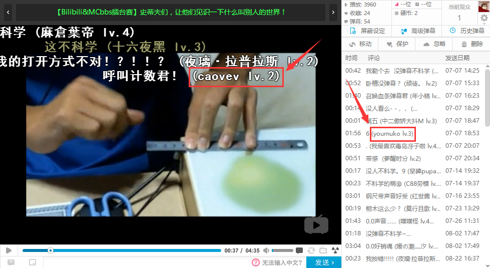

# BiliDanmaku[WIP]

Add user's name of each comment in bilibili.

## Runing Step

1.Append "127.0.0.1 comment.bilibili.com" to your hos file.

2.Running.

## Working Principle

To be continued...

## How Data Comes?

By using the method "getCrc32b" in class "StringUtils", you could able to generate an crc32b data for a string.

## Thanks to

Fuckbilibili(http://www.fuckbilibili.com/)

SuperFashi(http://www.superfashi.com/)
